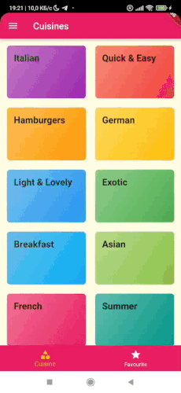
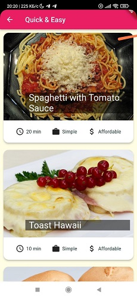
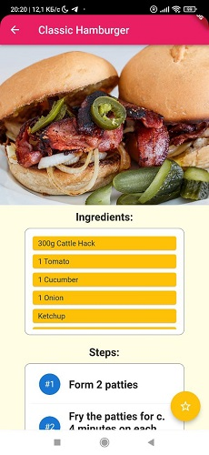

# Meals App

The app allows the user to select cuisine and meals. The user can view the recipe and add the meals to favorites. It is also possible to filter meals by the presence of certain ingredients in them.
___
## Technical description

Flutter 3.3.10 • Dart 2.18.6

`flutter_bloc 8.1.1` library is used for implementing BLoC pattern.

A cubit with a mock repository is used for cuisines.

A bloc with a mock repository - for meals.
___

*NOTE* since this project is a pet project, cases of overengineering are possible

